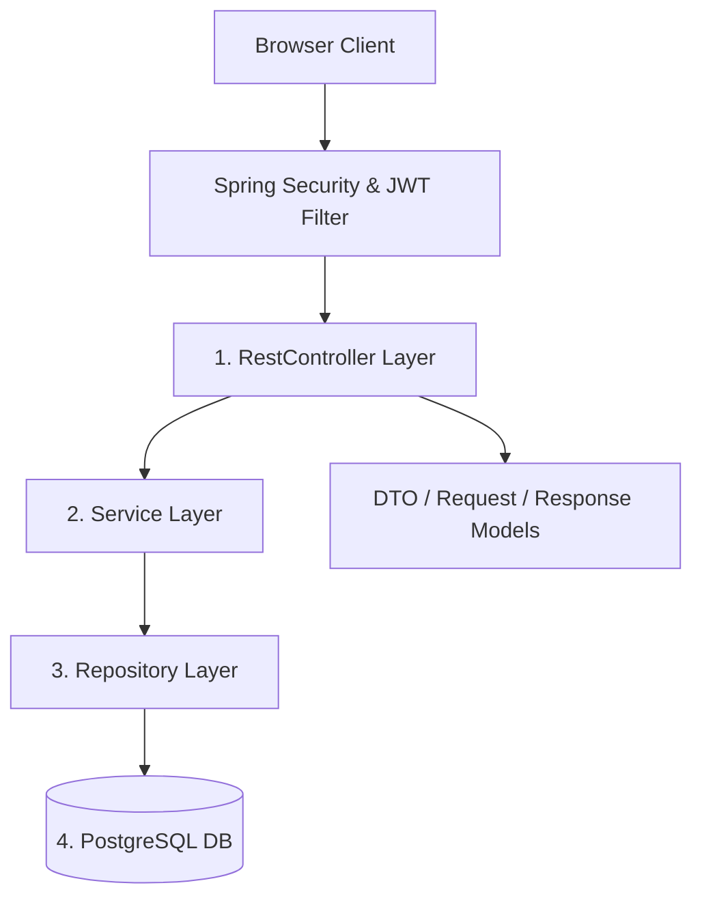

# DevFlow AI System Architecture

DevFlow AI is built on a clean, decoupled full-stack architectural pattern designed for high cohesion, scalability, and security.

---

## 1. Monorepo Organization
The repository is split into three main layers:
- **`backend/`**: Java 17, Spring Boot 3.x, REST API web server.
- **`frontend/`**: Angular 21 Single Page Application (SPA) compiled using Vite/esbuild and packaged with Nginx.
- **`docker-compose.yml`**: Deployment automation container configurations.

---

## 2. Backend Layered Architecture
The backend strictly follows a layered architectural pattern to isolate concerns and enforce domain constraints:

### Components
1. **Security & Filters**:
   - `JwtAuthenticationFilter` intercepts requests, parses Bearer tokens, validates signatures via `JwtService`, and populates the `SecurityContext`.
2. **Controller Layer (`RestController`)**:
   - Exposes REST endpoints, validates incoming payloads using `@Valid`, and translates response models.
3. **DTO Layer**:
   - `Request` models validate parameters before hitting services.
   - `Response` models prevent entity leaking and serialization recursion.
4. **Service Layer (`@Service`, `@Transactional`)**:
   - Implements business logic, enforces ownership rules, coordinates email events, and defines transaction boundaries (`@Transactional` at class/method level).
5. **Repository Layer (`JpaRepository`, `JpaSpecificationExecutor`)**:
   - Performs database interaction. Uses Spring Data Specifications for robust, dynamic, null-safe JPA Queries.
6. **Entity Layer (`@Entity`, JPA/Hibernate)**:
   - Maps database tables to Java objects. Relational collections are configured with `FetchType.LAZY` for query performance.

---

## 3. Frontend Architecture
The frontend utilizes the latest standalone component design paradigm in Angular 21:

- **State Management**: Uses Angular Signals (`signal`, `computed`, `effect`) for reactive state.
- **API Communication**: Centralized Http Client service mapping through `authInterceptor` to attach Bearer tokens.
- **Routing & Guards**: Lazy-loaded child routes protected by functional guards:
  - `authGuard`: Redirects unauthenticated requests to login.
  - `adminGuard`: Restricts Admin dashboard console paths to `ADMIN` roles.

---

## 4. Cross-Cutting Concerns
- **CORS Policies**: Explicitly white-lists the Angular origin with credentials while blocking wildcards.
- **Global Error Handling**: Centralized controller advice (`GlobalExceptionHandler`) translating validation, security, and runtime errors into structured payloads.
- **Simulations**: Safe fallback pipelines for Gemini AI and SMTP alerts when external API keys or configurations are missing.
