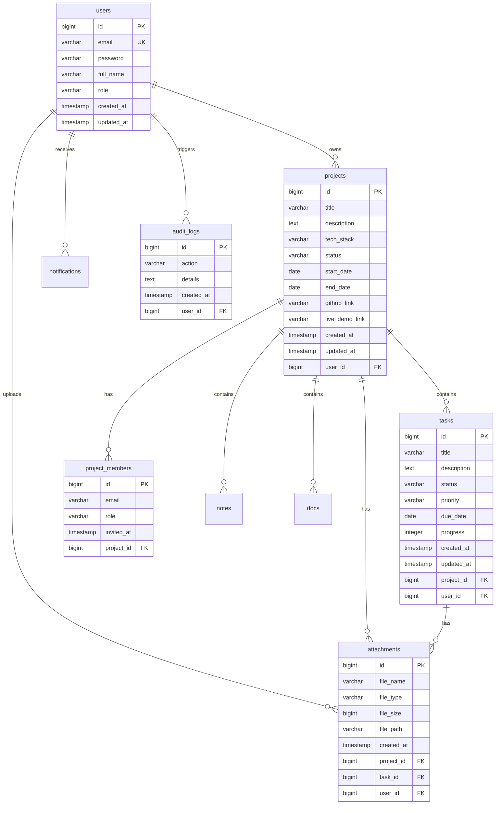

# DevFlow AI Database Design

DevFlow AI stores structured relation records using PostgreSQL. The relational mappings are designed for high integrity, isolation, and quick query lookups.

---

## 1. Entity Relationship Schema

Below is the database table configuration model:

---

## 2. Table Column Specifications & Indexes

### Table `users`
*   `email`: Configured with `UNIQUE` index. Lookups during logins are $O(1)$.
*   `role`: Stores role values (`USER`, `ADMIN`).

### Table `projects`
*   `user_id`: Foreign key reference to `users(id)` with ON DELETE CASCADE rules handled via JPA configuration.
*   *Performance Note*: Searches on title and description are mapped using case-insensitive lowercase matching inside dynamic query filters.

### Table `tasks`
*   `project_id`: Foreign key reference to `projects(id)`.
*   `status`: Restricts inputs to `TODO`, `IN_PROGRESS`, `REVIEW`, and `DONE`.

### Table `attachments`
*   `filePath`: Stores the full disk store path of the file. File records are decoupled from the PostgreSQL database engine blocks.
*   `project_id` & `task_id`: Nullable foreign keys, allowing task-specific uploads or project-wide wiki files.
